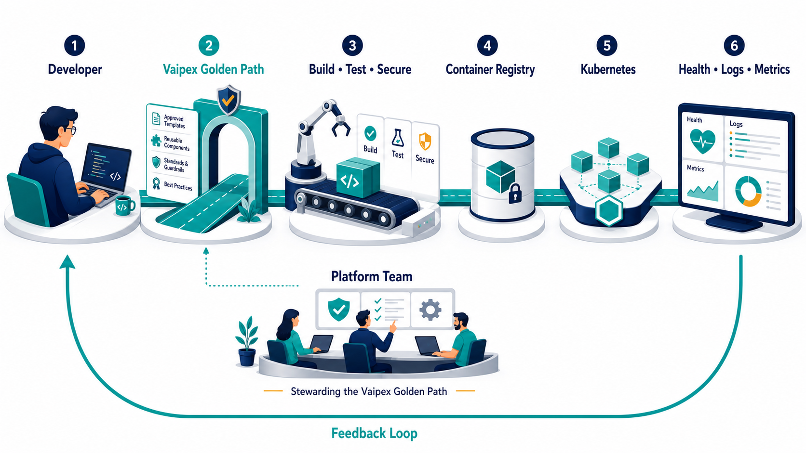

# Vaipex Golden Path

An open-source reference implementation for building secure, observable, and
production-ready services on Kubernetes.

Developed by **Vaipex Labs** for the developer and platform engineering
community.

## Overview

Engineering teams frequently recreate the same foundational capabilities for
every service: build automation, container packaging, deployment
configuration, health checks, observability, security controls, and continuous
integration.

Vaipex Golden Path is intended to provide an opinionated, reusable service
foundation that helps teams adopt consistent engineering standards without
requiring every developer to become an expert in the underlying platform
tooling.

The project will demonstrate how platform teams can deliver reusable
capabilities as a product, with a clear developer interface, sensible defaults,
automated guardrails, and documented extension points.

## Who This Is For

- Platform engineering teams designing internal developer platforms
- Application teams deploying services to Kubernetes
- SRE and DevOps teams standardizing production readiness
- Engineering leaders evaluating golden paths and paved-road strategies
- Developers seeking practical cloud-native reference implementations

## Project Goals

- Reduce the effort required to create a production-ready service
- Provide consistent build, test, package, and deployment workflows
- Establish secure and observable defaults
- Minimize the cognitive load placed on application developers
- Provide reusable patterns without creating a restrictive golden cage
- Demonstrate platform-as-a-product principles through working software
- Encourage community discussion around practical platform engineering

## Platform Principles

### Product-Oriented

Platform capabilities should be designed around developer needs, supported
interfaces, documentation, feedback, and measurable outcomes.

### Secure by Default

The supported path should provide secure defaults so application teams do not
need to discover every control independently.

### Observable by Default

Health, readiness, metrics, and structured logs should be foundational service
capabilities rather than optional additions.

### Opinionated but Extensible

The common path should be intentionally standardized. Supported extension
points should address legitimate workload differences without requiring teams
to duplicate the platform.

### Automated and Repeatable

Local and continuous-integration workflows should apply the same validations
to reduce environmental inconsistencies.

## Responsibility Model

### Platform Team

The platform team owns:

- Supported workflows and interfaces
- Build and deployment standards
- Secure defaults and automated guardrails
- Shared observability capabilities
- Documentation and versioning
- Platform reliability and developer experience

### Application Team

Application teams own:

- Business functionality
- Application tests
- Service-specific resource requirements
- Service-level objectives
- Domain-specific alerts and runbooks
- Operational ownership

## Delivery Roadmap

- [x] Define and document the golden path delivery flow.
- [ ] Define and document the reference architecture.
- [ ] Establish the service foundation and supported developer workflow.
- [ ] Add automated testing and quality validation.
- [ ] Create a secure production container.
- [ ] Add a reusable Kubernetes deployment model.
- [ ] Introduce observability and operational-readiness defaults.
- [ ] Add continuous-integration guardrails.
- [ ] Document customization, governance, and adoption guidance.

Each capability will be delivered as a small, independently verifiable change.

## Delivery

### Golden Path Delivery Flow

> A developer submits code, the platform verifies and packages it, Kubernetes runs it, and operational feedback shows whether it is working properly.

## Success Criteria

The project will be successful when a developer can:

- Clone the repository and understand its purpose quickly
- Test and run the reference service locally
- Build a secure container image
- Deploy the service to a local Kubernetes cluster
- Observe application health and operational metrics
- Validate changes through automated controls
- Customize documented settings without modifying platform internals

## Non-Goals

This project is not intended to:

- Replace a complete enterprise internal developer platform
- Prescribe one technology stack for every workload
- Eliminate the need for application ownership
- Hide operational responsibilities behind automation
- Demonstrate production-scale multi-cluster operations

It provides a focused reference implementation that teams can evaluate,
extend, and adapt to their environments.

## Contributing

Community feedback and contributions are welcome. Contribution guidance,
development setup, and review expectations will be added as the implementation
evolves.

## About Vaipex Labs

**Vaipex Labs** develops open reference implementations, engineering patterns,
and practical tools that help the developer community build reliable, secure,
and scalable software platforms.
